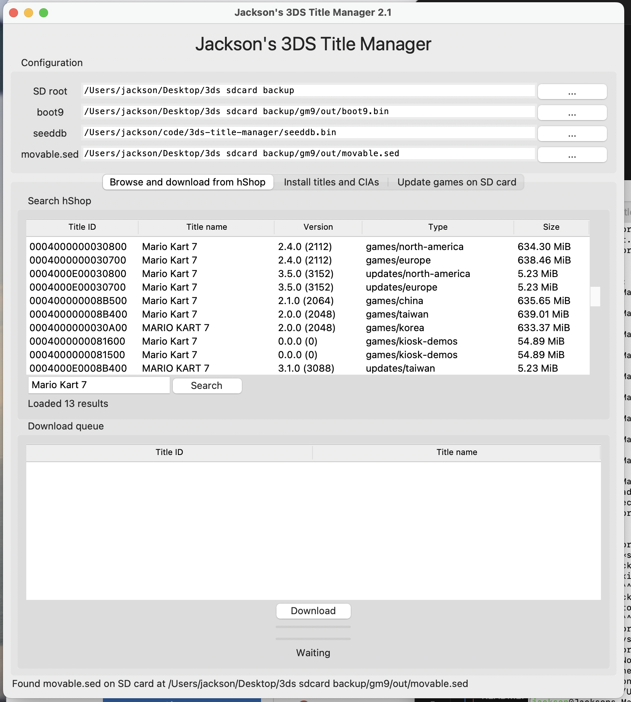

[]() 

# Jackson's 3DS Title Manager
*The authors of this program do not condone piracy. This program is intended to be used with legitimate copies of games and software.*



A fork of [ihaveamac's custom-install](https://github.com/ihaveamac/custom-install) that allows users to download and install titles directly from [HShop](https://hshop.erista.me/) to their Nintendo 3DS system's SD card.

It features the following improvements over the original `custom-install` program:
- Allows users to search and download titles directly from HShop, including the automatic detection and download of Downloadable Content (DLC) and title updates.
- The user can then, with one click, install these downloaded titles directly to their SD card, bypassing the need to use a program like FBI to install the CIA file.
- Includes a feature allowing users to quickly download all available updates and DLC packs for all the games installed on their SD card, that are not already installed.


## Installation
You're gonna need a copy of [seeddb.bin](https://github.com/ihaveamac/3DS-rom-tools/wiki/SeedDB-list), and your [boot9.bin and movable.sed files](https://ihaveamac.github.io/dump.html), regardless of installation method.

1. Download the latest version of Jackson's 3DS Title Manager:  
  
| Windows | macOS | Linux |
| ------- | ----- | ----- |
| [Download](https://nightly.link/jacksonrakena/3ds-title-manager/workflows/build-package/main/app-win.zip) | Coming soon, build from `main` | [Download](https://nightly.link/jacksonrakena/3ds-title-manager/workflows/build-package/main/app-linux.zip)

2. [Dump boot9.bin and movable.sed](https://ihaveamac.github.io/dump.html) from a 3DS system.
3. Download a copy of [seeddb.bin](https://github.com/ihaveamac/3DS-rom-tools/wiki/SeedDB-list), if you don't already have one.
4. Run `titlemanager`/`titlemanager.exe`.
5. **Important!** After installing any titles using Title Manager, you **must** run the `custom-install-finalize` Homebrew app in the Homebrew Launcher. It will be automatically copied to the root of your SD card by Title Manager when installing titles.
    - If this step is not completed, titles will not appear or function on the HOME Menu.

## 3DS firmware files
movable.sed is required and can be provided with `-m` or `--movable`.

boot9 is needed:
* `-b` or `--boot9` argument (if set)
* `BOOT9_PATH` environment variable (if set)
* `%APPDATA%\3ds\boot9.bin` (Windows-specific)
* `~/Library/Application Support/3ds/boot9.bin` (macOS-specific)
* `~/.3ds/boot9.bin`
* `~/3ds/boot9.bin`

A [SeedDB](https://github.com/ihaveamac/3DS-rom-tools/wiki/SeedDB-list) is needed for newer games (2015+) that use seeds.  
SeedDB is checked in order of:
* `-s` or `--seeddb` argument (if set)
* `SEEDDB_PATH` environment variable (if set)
* `%APPDATA%\3ds\seeddb.bin` (Windows-specific)
* `~/Library/Application Support/3ds/seeddb.bin` (macOS-specific)
* `~/.3ds/seeddb.bin`
* `~/3ds/seeddb.bin`


## Development

### Building Windows standalone

Using a 32-bit version of Python is recommended to build a version to be distributed.

A [virtual environment](https://packaging.python.org/guides/installing-using-pip-and-virtual-environments/#creating-a-virtual-environment) is recommended to isolate the packages from system directories. The build script `make-standalone.bat` assumes that the dependencies are in PATH.

Install the dependencies, plus cx-Freeze. In a virtual environment, the specific Python version doesn't need to be requested.
```batch
pip install cx-freeze -r requirements-win32.txt
```

Copy `custom-install-finalize.3dsx` to the project root, this will be copied to the build directory and included in the final archive.

Run `make-standalone.bat`. This will run cxfreeze and make a standalone version at `dist\custom-install-standalone.zip`

## License/Credits
The original `custom-install`, which does most of the legwork for this program, is &copy; 2019-2021 Ian Burgwin under the MIT License.

[save3ds by wwylele](https://github.com/wwylele/save3ds) is used to interact with the Title Database (details in `bin/README`).

Thanks to @nek0bit for redesigning `custominstall.py` to work as a module, and for implementing an earlier GUI.

Thanks to @LyfeOnEdge from the [brewtools Discord](https://brewtools.dev) for designing the second version of the GUI. Special thanks to CrafterPika and archbox for testing.

Thanks to @BpyH64 for [researching how to generate the cmacs](https://github.com/d0k3/GodMode9/issues/340#issuecomment-487916606).

Remaining code and contributions &copy; 2024 Jackson Rakena under the MIT License.